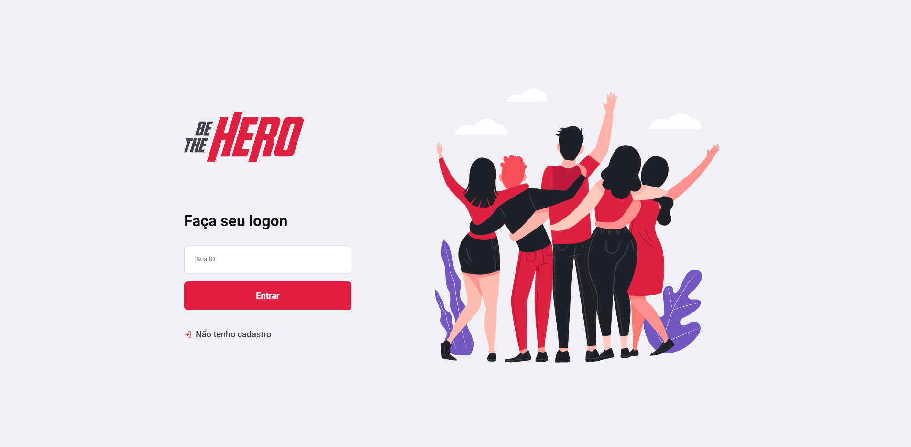
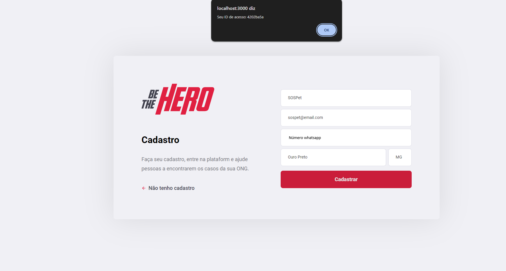
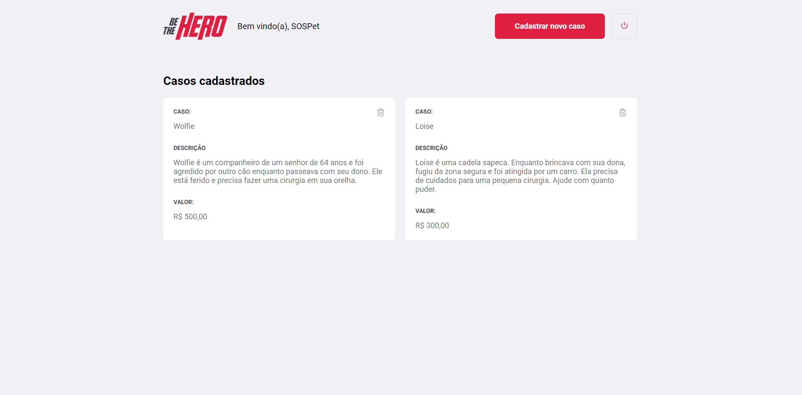
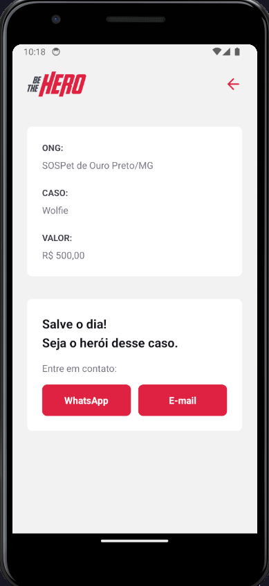
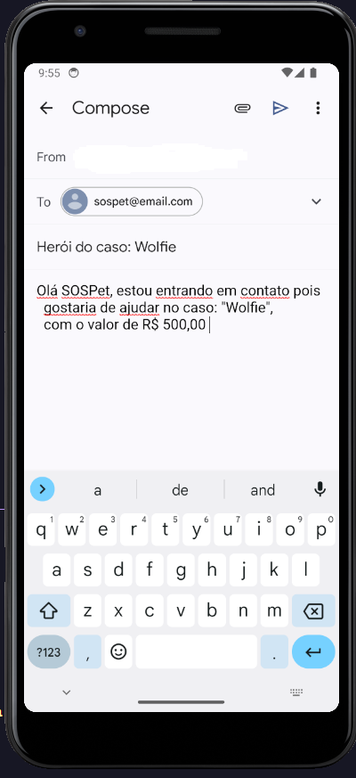

<h1 align="center">

  <h1 align="center">
  Omnistack 11 :rocket:  
  </h1>
</h1>
  
  

<h2> O que é ? <h3> Aplicação para conectar ONGs e outras instituições a pessoas que tem disponibilidade para ajudar.</h3> </h2>

# Sobre o projeto :mag:
Uma aplicação para cadastrar ONG's onde essas podem cadastrar os casos que estão precisando de doação. O usuário têm acesso a um aplicativo onde pode enviar um email ou uma mensagem por whatssap à respectiva ONG e seu caso. A aplicação utilizará a Web para cadastrar as ONG´s e os casos que precisam de ajuda para que através do dispositivo mobile, o usuário possa entrar em contato para ajudar na causa.

## Telas 

  <b>Aplicação WEB</b>
   
    
    
    

  <b>Apliação Mobile</b>
   
    
     

# Principais aprendizados :bow:
* SPA
* Rotas
* Desenvolver mobile/web com o React
* Servidor com node 
* Knex e Migrations no banco de dados
* Testes com Supertest e o Jest
* Celebrate pra tratativa de exceções no backend

# Tecnologias e frameworks utilizadas em cada ambiente
## Back-end :package:	
- Node  
- Knex
- Nodemon
- Supertest
- Jest
- SQLite3
- Cors 
- Celebrate
- Software Insomnia
## Front-end :memo:
- Node
- React
- Axios
- React-router-dom
- React-icons
- Font awesome
## Mobile
- Node
- React Native
- Expo
- Axios
- Intl (conversão de moedas)
- react-navigation
- react-dom
- expo-mail-composer

# Como executar o projeto
## Clonar o repositório na sua máquina.
### Executar no terminal para as pastas frontend/mobile/backend
~~~javascript
npm install node
~~~
### Em seguida startar a aplicação no terminal
#### Siga para a pasta frontend cd ./frontend e digite 
~~~ javascript
npm start
~~~~
O mesmo acima para cd ../backend 
### Requisitos para rodar a versão mobile
* Baixar o Expo na playstore
##### Executar o seguinte comando na pasta cd ../mobile
~~~javascript
npm start
~~~
#### Próximo passo
##### Escanear o QR CODE que será gerado e automaticamente a aplicação ficara online desde que o backend e o mobile esteja inicializado.

### Instrutor: CTO da [Rocketseat](https://rocketseat.com.br/) :rocket: Diego Fernandes
<td align="center"><a href="https://rocketseat.com.br"> <b>Diego Fernandes</b>
</a> </td>

## 🦸 Autor

Feito por Jason Everton 👋🏽 [Entre em contato!](https://www.linkedin.com/in/jason-everton)

